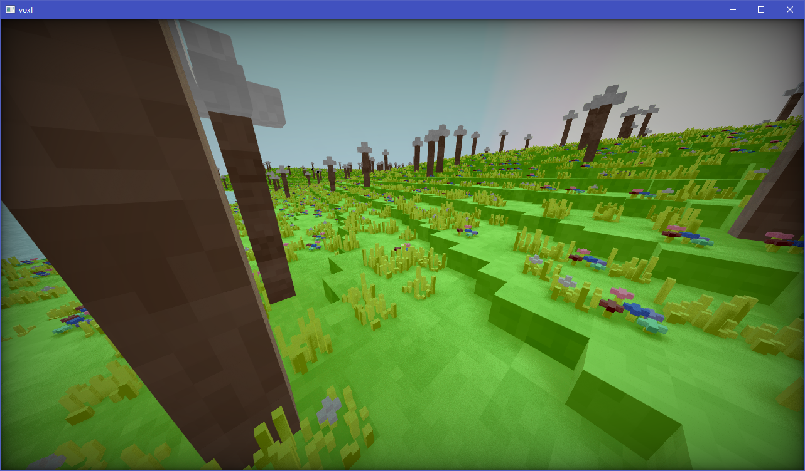
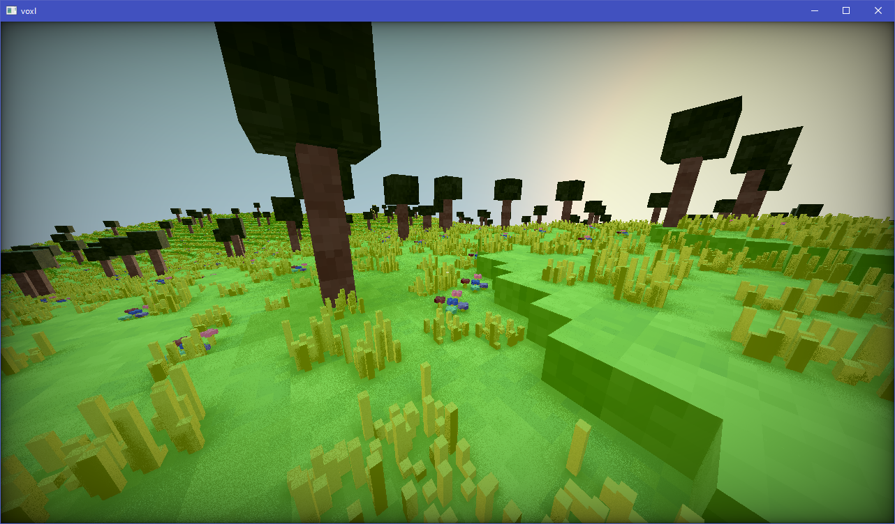

<div align="center">
    <h1><code>unnamed-voxel-tracer</code></h1>
        Voxel raytracer prototype written in Zig using OpenGL.
    <hr>
</div>

**Controls**
```
    W, A, S, D - Camera movemement,
    Space - Fly higher
    Shift - Fly less higher
    R - Reload shaders
```




# License

Licensed under MIT License, check `LICENSE` in repo root for more information.